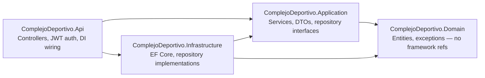

# 🏟️ Complejo Deportivo | Sports Facility Booking API


A booking system for sports facility complexes: courts, availability, multi-court reservations with time-based pricing, and a role-based admin dashboard. Built with **Clean Architecture** (ASP.NET Core 8 + EF Core), fully covered by an integration-first test suite running against a real SQL Server via Testcontainers, with a static HTML/JS frontend consuming the API.

---

## Architecture

Four class libraries with compiler-enforced, one-directional dependencies — `Domain` has zero references to EF Core or any framework concern:



| Project | Responsibility |
|---|---|
| `ComplejoDeportivo.Domain` | Entities and domain exceptions. No dependency on EF Core, ASP.NET Core, or anything outside the BCL. |
| `ComplejoDeportivo.Application` | Business logic (`Services`), DTOs, repository *interfaces*. Depends only on `Domain`. |
| `ComplejoDeportivo.Infrastructure` | EF Core `DbContext` and repository *implementations*. Depends on `Application` (for the interfaces) and `Domain`. |
| `ComplejoDeportivo.Api` | Controllers, JWT middleware, global exception handling, DI container wiring. The only project that knows about all the others. |
| `ComplejoDeportivo.Tests` | 458 tests: unit tests (services, DTOs, controller edge cases with mocked dependencies) + integration tests against a real SQL Server via Testcontainers, including a full end-to-end reservation flow. |

## Features

- **Multi-court booking** — reserve several courts in a single transaction, hour-by-hour availability checks per court, differential pricing (e.g. floodlit hours after 19:00).
- **Role-based access** — `Cliente` / `Empleado` / `Admin`, enforced per endpoint and per record (a client can only see/cancel their own reservations, validated against their JWT).
- **JWT authentication** with BCrypt password hashing.
- **Admin dashboard** — revenue KPIs, reservation status breakdown, top-10 courts by bookings, top-10 clients by spend, filterable by date range and complex.
- **Full ABMC (CRUD)** for complexes, courts, clients, employees, and user accounts. Court types only expose create/read (no update or delete endpoint exists).

## Tech Stack

- **ASP.NET Core 8** Web API, split into a 4-project Clean Architecture solution
- **Entity Framework Core 8** (SQL Server)
- **JWT Bearer** authentication, **BCrypt.Net** for password hashing
- **Swashbuckle / Swagger** for API exploration
- **xUnit + FluentAssertions + Moq + Testcontainers.MsSql** for testing, **coverlet** for coverage enforcement (100% branch, 99%+ line — see the `Threshold` comment in `ComplejoDeportivo.Tests.csproj` for the one accepted, evidence-backed line exception)

## API Overview

See [endpoints.md](endpoints.md) for the full endpoint reference (permissions, request bodies, and behavior notes per endpoint). Highlights:

| Module | Endpoints |
|---|---|
| Auth | `POST /api/auth/login`, `POST /api/account/register`, `POST /api/account/register-empleado` |
| Reservations | `GET /api/reserva/complejos`, `GET /api/reserva/disponibilidad`, `POST /api/reserva`, `PUT /api/reserva/cancelar` |
| Dashboard | `GET /api/dashboard` (KPIs, charts, rankings) |
| Admin (ABMC) | Clients, employees, courts, court types, complexes, user accounts |

## Setup

```powershell
# 1. Restore and create the database
dotnet restore
dotnet ef database update --project ComplejoDeportivo.Infrastructure --startup-project ComplejoDeportivo.Api
# or run database/create-database.sql directly against your SQL Server instance

# 2. Set your own JWT signing key (don't use the placeholder in appsettings.json)
dotnet user-secrets set "Jwt:Key" "<your-own-random-secret>" --project ComplejoDeportivo.Api

# 3. Run the API
dotnet run --project ComplejoDeportivo.Api
```

The frontend (`Front/`) is static HTML/JS — open `Front/index.html` directly or serve it from any static file server, pointed at the running API.

## Testing

```powershell
dotnet test
```

Runs unit tests plus full integration tests against a real, disposable SQL Server instance spun up via [Testcontainers](https://testcontainers.com/) — requires Docker running locally. Enforces a coverage threshold (`coverlet.msbuild`) on every run; a coverage regression fails the build, same as CI.

## Academic Context

Developed as the final integrative assignment (TPI) for Programación II at UTN FRC — object-oriented design, layered architecture, a Web API consumed by a web client, and JWT-based auth were the core requirements. Since then, refactored into a proper Clean Architecture split and brought to a fully-tested state for portfolio presentation.

---

*Developed by [Martin Lantieri](https://github.com/Lantieridev) - 2026*
